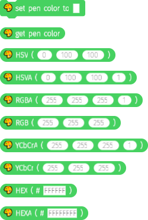
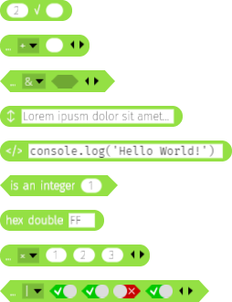
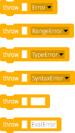
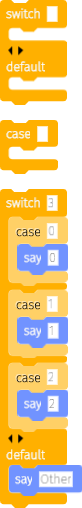
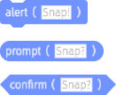
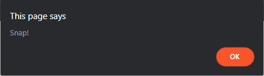
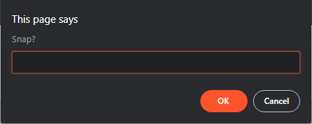
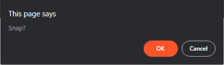
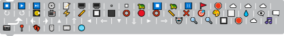

# Snap​*!*

A collection of libraries to use with [Snap*!*](https://snap.berkeley.edu)

> All screenshots are taken using a custom build of Snap which has slightly different colors, uses Unicode characters instead of canvas drawings and has different fonts.

## Colors



> The 🎨 emoji is used instead of `$paintbucket`

### Set pen color to (color)

Sets the current sprite's pen color to (color).

### Get pen color

Returns the current pen color as a `Color`.

### HSV (h, s, v)

Returns a `Color` created using the HSV colors provided.

* `h` in the range 0°-360°
* `s` in the range 0%-100%
* `v` in the range 0%-100%
* Alpha is set to 100%

### HSVA (h, s, v, a)

Returns a `Color` instance using the HSV colors provided, plus alpha.

* `h` in the range 0°-360°
* `s` in the range 0%-100%
* `v` in the range 0%-100%
* `a` in the range 0-1

### RGB (r, g, b)

Returns a `Color` instance using the RGB colors provided.

* `r` in the range 0-255
* `g` in the range 0-255
* `b` in the range 0-255
* Alpha is set to 100%

### RGBA (r, g, b, a)

Returns a `Color` instance using the RGB colors provided, plus alpha.

* `r` in the range 0-255
* `g` in the range 0-255
* `b` in the range 0-255
* `a` in the range 0-1

### YCbCr (y, cb, cr)

Returns a `Color` instance using the YC<sub>B</sub>C<sub>R</sub> color scheme.

* `y` in the range 0-255
* `cb` in the range 0-255
* `cr` in the range 0-255
* Alpha is set to 100%

### YCbCrA (y, cb, cr, a)

Returns a `Color` instance using the YC<sub>B</sub>C<sub>R</sub> color scheme, plus alpha.

* `y` in the range 0-255
* `cb` in the range 0-255
* `cr` in the range 0-255
* `a` in the range 0-1

### HEX (# str)

Returns a `Color` instance using the hex string provided.

* Alpha is set to 100%

### HEXA (# str)

Returns a `Color` instance using the hex (with alpha) string provided.

### Also included

The whole Throw lib and two operators from Operators (hex double, is integer) are included to be used internally.

### Get

[colors.xml](colors.xml)

## Operators



### nth root

The operator ()√() takes two arguments. The first one is the index of the root, the second one is the radicand.

### Variadic +/×

The operator reduces a list by summing or multiplicating all of the items provided.

### Variadic &/|

The operator reduces a list by AND-ing or OR-ing all of the items provided.

### Multiline (↕)

The operator is a utility for writing multiline strings.

### Code (&lt;/>)

The operator is a utility for writing monospace multiline strings.

### Is (n) an integer

Returns whether `n` is an integer (true) or a floating-point number (false).

### Hex double (hex)

Returns the two hex characters provided as a number. If only one character is provided, returns `(char) * 0x10 + (char)`

### Get

[operators.xml](operators.xml)

## Throw



### Throw (message) (type)

Throws an error `message`. Type is one of `Error`, `RangeError`, `TypeError` and `SyntaxError`.

### Throw (message) (custom type)

Throws an error `message` of type `custom type`. It is up to the user to be sure `custom type` is instantiatable by

```js
new (eval(customType))(message)
```

### Get

[throw.xml](throw.xml)

## Switch



### Switch (what) (...cases) (default)

Switches on `what` for all the `cases`. When one is matched, exits. If none is matched, runs `default`. Cases should all contain `case` blocks.

### Case (case) (run)

To be used inside of `switch`. `run` gets called if `case` matches what `switch` is switching.

> Important: `case` and `switch` work with codification. You can have codification disabled, and it will still work. However, when codificating to another language, either don't codificate `switch` and `case` or cleanup by setting all types' code to `<#1>` and `case`'s code to `<#1>`.

### Get

[switch.xml](switch.xml)

## Window



### Alert (what)

`window.alert`s `what`.



### Prompt (what)

`window.prompt`s `what` and returns the input.



### Confirm (what)

`window.confirm`s `what` and returns `true` if OK (or equivalent) was pressed or `false` if Cancel (or equivalent) was pressed.



### Get

[window.xml](window.xml)

## Icon Test



The only block contained showcases all of Snap's default icons.

> You can clearly see that I use a custom build here!

### Get

[icontest.xml](icontest.xml)

## License

MIT

## Changelog

### 1.0.0

Inital release
